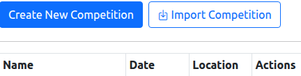
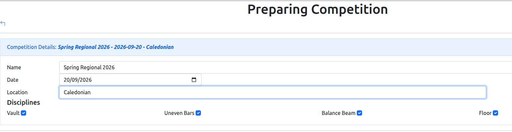
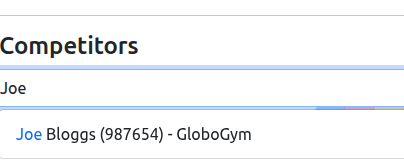
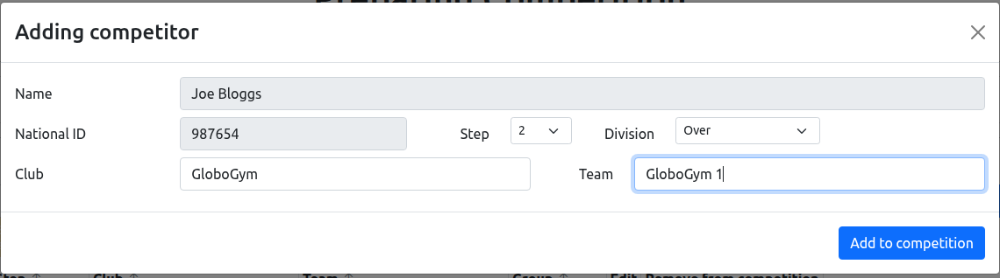
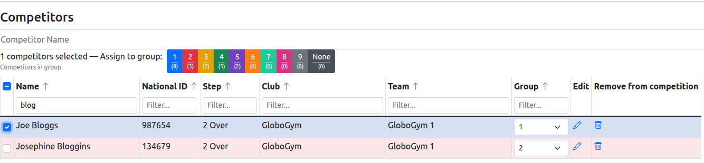
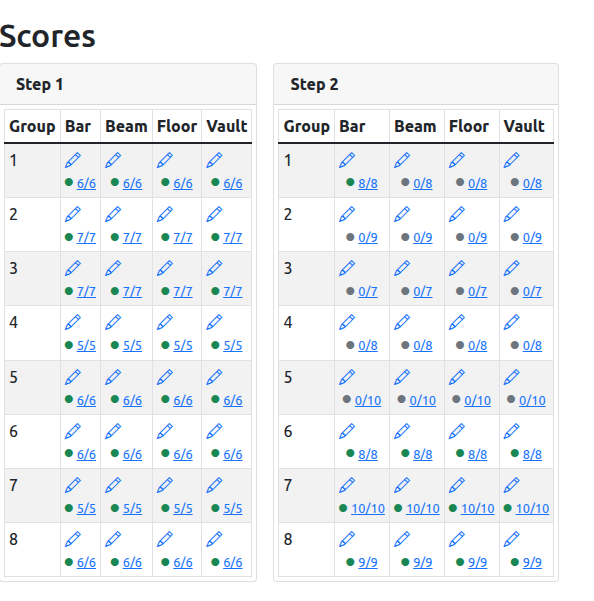
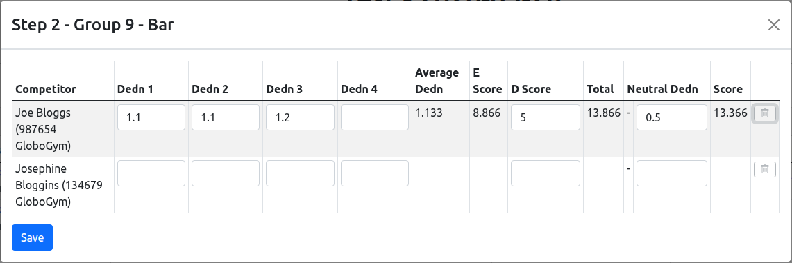

# GymScore User Guide

GymScore is a standalone, offline desktop application for managing gymnastics competitions.
It handles competitor registration, live score entry, and results generation — no internet
connection required.

---

## Installation

### Windows

Download the `.exe` file from the [Releases page](https://github.com/craigmiskell/gymscore/releases)
and run it directly. No installation is required — it is a portable executable.

### Linux

Download the `.deb` package and install it:

```shell
sudo dpkg -i gymscore_*.deb
```

Supported on Debian, Ubuntu, and derivatives.

### macOS

Download the `.zip` archive, unzip it, and move `gymscore.app` to your Applications folder.

> **Note:** macOS packages are not currently code-signed. After the first launch attempt you may
> need to allow the app via **System Settings → Privacy & Security**.

---

## Managing Competitions

### Creating a Competition

To start a new competition, click the **Create New Competition** button near the top of the main screen.

{width=100%}

This opens the **Prepare Competition** page. A **Competition Details** panel will be expanded
and ready for you to fill in:

- **Name** — The title of the competition (e.g. "Spring Regional 2026").
- **Date** — The date the competition takes place.
- **Location** — The venue name or address.
- **Disciplines** — Tick each apparatus that will be judged in this competition
  (Vault, Uneven Bars, Balance Beam, Floor).

{width=100%}

There is no Save button — GymScore saves your details automatically as you type. After the first
time you view a competition, the panel collapses to show a summary only. You can click on it at
any time to expand and make changes.

---

### Adding Competitors

After filling in the competition details, you can add competitors in the section below. GymScore
keeps a local database of known competitors so that you can quickly find and add people who have
competed before.

#### Finding an existing competitor

Start typing a competitor's name in the **Competitor Name** field. A list of matching competitors
from your local database will appear below the field; clicking a name in that list will select
them and open the modal window. The search/autocomplete also looks at their club name and their
national ID; use whichever is most convenient.

{width=100%}

Once you have selected a competitor (or typed a name that is not in the database), click
**Add to Competition**. A form will appear with the competitor's details pre-filled where known.

#### Filling in the competitor form

{width=100%}

The form contains the following fields:

- **Name** — The competitor's full name.
- **National ID** — The competitor's unique identifier issued by the governing body.
- **Step** — The competitor's current level (1–10).
- **Division** — For Steps 1–8, select either *Under* or *Over*. This field does not appear for Steps 9 or 10.
- **Club** — The club the competitor represents. Start typing and existing known clubs will be suggested.
- **Team** — Optional. If the competitor belongs to a team, enter the team name here. If the club
  already has teams in this competition, they will appear as suggestions. If no teams exist yet,
  GymScore will suggest a name like *Springfield Gym 1* as a starting point — you can accept this
  or type a different name. Teams are created automatically when you save. While the name will
  typically include the club name, it is freeform and can be whatever name you like.

Click **Add to competition** to save. The form will close and return to the competitor list,
ready for you to add the next competitor.

> **Tip:** You can add competitors one after another quickly — after each one is saved, the cursor
> moves back to the Competitor Name field automatically. The tab key will also move you quickly
> through the required fields including choosing from the autocomplete, and hitting enter while in
> the Team field will add the competitor. You can add competitors in succession without needing to
> use your mouse, if you prefer.

#### Editing or removing a competitor

Once competitors have been added, they appear in a table. You can:

- Click the **pencil icon** on a row to edit that competitor's Step, Division, or Team for this competition.
- Click the **bin icon** to remove a competitor from this competition.

You can also filter the list by typing in the boxes below each column heading, and sort the list
by clicking any column heading.

---

### Groups

Groups let you divide competitors into separate pools for the running of the competition.

Each competitor can be assigned to a numbered group (1–9).

#### Assigning groups one at a time

In the competitor table, each row has a **Group** column. Click the dropdown in that column
and select a group number for that competitor.

#### Assigning groups in bulk

To assign several competitors to a group at once:

1. Tick the checkbox on the left of each competitor you want to assign. To select everyone currently visible in the
   list, use the **Select All** checkbox at the top.
    - Consider using the filters to find the competitors you want (e.g. by step and team), then use **Select All**.
2. Once one or more competitors are selected, a row of numbered group buttons (1–9) will become active above the table.
3. Click the group number you want to assign. All selected competitors will be moved to that group immediately.

{width=100%}

Each group button shows a count in brackets (e.g. **1 (5)**) indicating how many competitors
are already in that group, which helps you keep groups balanced.

Rows in the table are colour-coded by group so you can see at a glance how competitors are distributed.

> **Note:** Group assignments are saved automatically as you make them.

---

## Generating Recording Sheets and Programme PDFs

Once competitors have been added and assigned to groups, you can generate two PDFs that are
needed on competition day: a **programme** for participants and spectators, and **recording
sheets** for the judges.

To generate them, go to the main screen and click **Rec/Programme PDFs** in the Actions column
for your competition.

> **Before generating:** Make sure all competitors have been assigned to a group. If any
> competitors are still unassigned, GymScore will warn you and ask whether to proceed anyway.
> If you do proceed in such a case, unassigned competitors will be left out of both PDFs.

GymScore will generate the files and open them, typically in your main web browser. They will
have been saved in your personal directory:

```shell
GymScore/<competition name> - <date>/
```

so you can open them again later.

---

### The Programme

The programme lists every competitor grouped by their rotation group, one page per Step level.
Each group shows which apparatus they start on, and the order it rotates through the remaining
apparatus, so competitors and coaches know where to go and when.

Each entry shows the competitor's name, their club, their team (if any), and their division
(Under or Over, for Steps 1–8).

---

### Recording Sheets

Recording sheets are created per combination of Step, apparatus, and group. Each sheet has:

- The competition name, location, and date in the header.
- The Step level, apparatus, and group number.
- Signature lines for the Head Judge and up to three judges.
- A row for each competitor in that group, with columns for each judge's deductions, the
  calculated E Score, a D Score column, and a final Score column.

The sheets are ordered by apparatus (Vault → Bars → Beam → Floor), then by Step, then by group.

---

## Running the Competition

### Live Score Entry

To enter scores, go to the main screen and click **Record Scores** for your competition. This
opens the live score entry screen, which shows a grid of every Step and group in the competition.

{width=100%}

Each cell in the grid represents one combination of Step, group, and apparatus. The coloured dot
and fraction (e.g. **3/5**) show how many competitors in that cell have had scores recorded:

- **Grey** — no scores entered yet
- **Yellow** — some scores entered
- **Green** — all competitors in this group have scores

Click the pencil icon in any cell to open the score entry panel for that Step, group, and apparatus.

---

#### Entering Scores

The score entry panel lists every competitor in that group for the chosen apparatus. Each row has
the same columns as the scoring sheet, except that the following are automatically calculated by
GymScore:

- Average Dedn
- E Score
- Total
- Score

**To record a competitor's score:**

1. Enter the deduction value from each judge in the **Dedn 1**, **Dedn 2** (and optionally
   **Dedn 3** and **Dedn 4**) fields. At least two judges' deductions are needed.
2. Enter the **D Score**.
3. Enter any **Neutral Deductions**, or leave blank if there are none.
4. The E Score, Total, and final Score columns update automatically as you type.

When four judges' deductions are entered, the highest and lowest values are dropped and the
middle two are averaged. With two or three judges, all entered values are averaged.

> **Tip:** When the panel opens, the cursor is placed on the first empty D Score field. You can
> use **Tab** to move quickly between fields to enter scores without using the mouse.

When recording scores from the written sheets, take the time to compare the values that GymScore
calculates with the written ones. Any discrepancies here might indicate a typo in your entry, or
a miscalculation on the original recording sheet which may need correcting.

{width=100%}

Once you have entered all the scores for this group and apparatus, click **Save**, which close the panel.

> **Unsaved changes:** If you try to close the panel without saving, GymScore will warn you.
> You can choose to go back and save, or discard the changes.

---

#### Correcting a Score

To correct a score you have already saved, click the pencil icon for the same cell again, and edit the recorded scores.

To clear all scores for one competitor (for example, if they were entered on the wrong row),
click the **bin icon** on the right of their row.

---

#### Navigating Between Groups and Apparatus

Close the current panel and click a different cell in the grid to switch to another group or
apparatus. The grid updates its status dots after each save so you can see at a glance what
still needs to be recorded.

---

## Results

Once scores have been recorded, click **Result PDFs** for the competition on the main screen.
If any scores are still missing, GymScore will ask whether you want to generate results anyway.

GymScore generates three PDF files, saves them in the same location as the programme + recorder
sheets, and opens them (typically in your web browser):

| File | Purpose |
| --- | --- |
| `results.pdf` | Full detailed results for every competitor |
| `places.pdf` | Top-three placements per apparatus and overall, with team results |
| `announcements.pdf` | A script for reading placings aloud at the awards ceremony |

---

## Data Management

### Archiving and Deleting Competitions

Once a competition is finished, click **Archive** in its Actions row. This moves it from the
**Active Competitions** table to the **Archived Competitions** section at the bottom of the
screen, keeping all its data intact. Archiving is reversible — you can still export results or
re-open scores from an archived competition.

To permanently remove a competition, archive it first, then click **Delete** from the archived
list. GymScore will ask you to confirm, as this cannot be undone. Export any PDFs you need
before deleting.

---

### Exporting a Competition

Click **Export** in the Actions column for the competition. GymScore will prompt you to choose
where to save the file, which has a `.gscomp.gz` extension. This file contains the full
competition — all competitors, scores, teams, and clubs — and can be shared with another
computer running GymScore or kept as a backup.

---

### Importing a Competition

Click **Import Competition** near the top of the main screen and select a `.gscomp.gz` file.

**If the competition already exists** (same name and date), GymScore will ask what to do:

- **Import as copy** — imports with the suffix `(imported)`, leaving your existing copy untouched.
- **Overwrite existing** — replaces your existing copy with the imported version.

**If competitor names differ from your database** (matched by national ID), GymScore will show a
reconciliation screen listing each mismatch, letting you choose whether to keep your existing name
or adopt the name from the file. This can happen if a name was corrected between competitions.

---

## Records & Database Management

### Records

The **Records** section on the main screen gives you access to two master lists that GymScore
uses across all competitions:

- **Edit known competitors** — view, edit, or remove competitors from the global database.
  Competitors are added here automatically the first time they are added to any competition.
- **Edit clubs** — manage the list of clubs. Clubs are added automatically as you use them,
  but you can rename or remove them here.

---

### Database Backup and Restore

The **Database Management** section at the bottom of the main screen lets you back up or restore
the entire GymScore database — all competitions, competitors, and clubs at once.

**Export database** saves everything to a single `.json.gz` file. The default filename includes
today's date. Keep this somewhere safe as a backup.

**Import database** replaces *everything* currently in GymScore with the contents of the selected
file. GymScore will warn you clearly before proceeding, as this permanently deletes all current
data and cannot be undone. Make sure you have a current export before importing.

**Delete database** wipes all data from GymScore entirely. Again, GymScore will ask you to
confirm first. This is useful if you need to start fresh.
